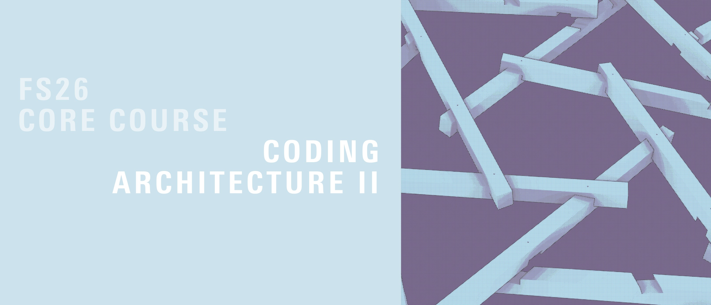
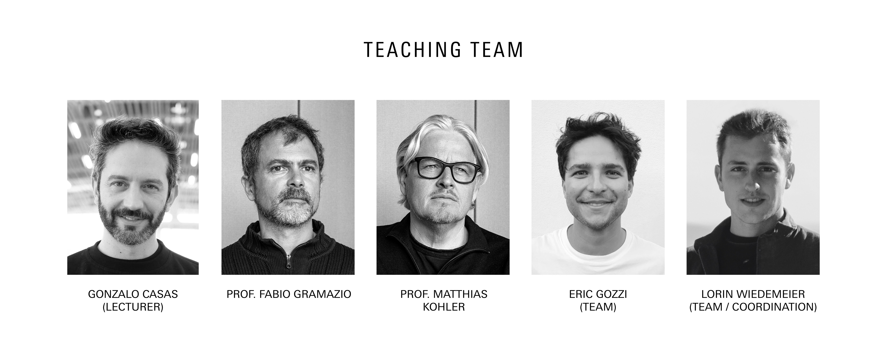
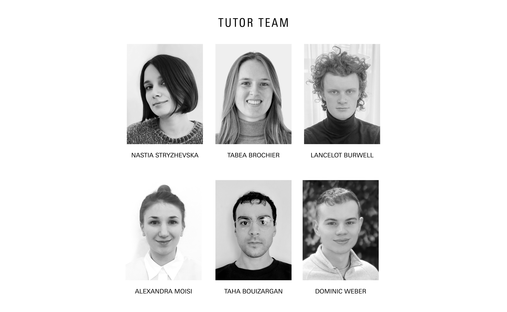

# Coding Architecture II: FS26

Materials for the "Coding Architecture II", Spring Semester 2026.

> Coding Architecture I-II 
> is a **programming class for architects** 
> with particular focus on **demystifying technology**
> -both software and hardware- 
> **and exploring the programmability of our world** 
> through powerful methods of digital, computational, and algorithmic design.

In the spring semester, we dive into digital timber using the `compas_timber` library to design reciprocal frame structures and materialize them.

## Semester Overview

## Team

## Getting started

See [here](getting-started/README.md) for details about software requirements and installation of the tools.

## Course information

The central platform for all course content is [Moodle](https://moodle-app2.let.ethz.ch/course/view.php?id=27218).

## Lectures

* Week 00 | [📽️ Python Refresher video](https://youtu.be/RVdyx8F6A0c) | [📽️ Installation guide](https://youtu.be/a2k6VeNUShg)
* [Week 01](lectures/week-01/README.md) | [📚 Assignment A00: Ungraded](assignments/A00-compas-timber/README.md)

## Focus Work (Optional)

The Focus Work (Optional) takes place from June 1 – June 28, 2026 and corresponds to 6 ECTS (20 full working days).

During this period, selected semester projects will be further developed, technically consolidated, fabricated, and assembled at full scale. The work includes:

* Refinement and technical detailing of the chosen design
* Preparation for digital fabrication (CNC, toolpaths, material logistics)
* Production of timber elements
* On-site assembly and construction

Participation is limited and prioritised for students enrolled in Coding Architecture II. Exact Number of Participants will be revealed in the first weeks of the semester.

Registration and further details are provided via Moodle.

## Roadmap

See [here](roadmap/README.md) for the **Roadmap: becoming a computational designer**,
that provides guidance during the learning process and helps you understand how much
you've progressed and what are the skills and concepts that you should master in order
to move forward.

## Teaching Material

We have compiled a list of essential links and resources to support your learning throughout the semester. These materials cover foundational topics in reciprocal frame structures, and reference material in programming, computational geometry and COMPAS framework.

### Foundational Material

- [Reciprocal Frames - Tradition and Innovation](https://verlag.gta.arch.ethz.ch/de/gta:book_978-3-85676-344-2), Udo Thönnissen
- [Reciprocal Frame Architecture](https://www.taylorfrancis.com/books/mono/10.4324/9780080556000/reciprocal-frame-architecture-olga-popovic-larsen), Olga Popovic-Larsen, 2008
- [Form-finding and analysis of tension structures by dynamic relaxation](https://journals.sagepub.com/doi/10.1260/0266351991494722), Michael Barnes, 1999
- [A Survey on Quad Meshing](https://www.researchgate.net/publication/261849625_Quad-Mesh_Generation_and_Processing_A_Survey), Bommes et al., 2013

### Python

- [Python 3.9 Reference](https://docs.python.org/3.9/)
- [Python Roadmap](https://roadmap.sh/python)
- [Python Cheat Sheet](https://learnxinyminutes.com/python)

### COMPAS

- [COMPAS Docs](https://compas.dev/compas/2.15.0)
- [COMPAS API Reference](https://compas.dev/compas/2.15.0/api/index.html)
- [COMPAS Timber documentation](https://gramaziokohler.github.io/compas_timber/1.0.4/)

### Books

For online access using your ETH Account, you have to be in the ETH network or VPN.

- [Geometric Computation: Foundations for Design](https://www.taylorfrancis.com/books/mono/10.4324/9781315765983/geometric-computation-foundations-design-joy-ko-kyle-steinfeld). Ko, Joy, and Kyle Steinfeld. London: Routledge, 2018.
Online access with ETH Account: Link
[ Copy available at ETH Architecture and Civil Engineering Library ]  ISBN : 1-317-65907-4
- [Morphing: a Guide to Mathematical Transformations for Architects and Designers](https://www.oreilly.com/library-access/?next=/library/view/morphing/9781780677224/). Choma, Joseph. London: Laurence King Publishing, 2015.
Online access with ETH Account: Link
[ Copy available at ETH Architecture and Civil Engineering Library ] ISBN : 1780674139
- [AAD_algorithms-Aided Design: Parametric Strategies Using Grasshopper®](https://www.arturotedeschi.com/books). Tedeschi, Arturo, and Fulvio Wirz.  Brienza (Potenza): Le Penseur, 2020.
ISBN : 9788895315300
- [Digital Media Series: Grasshopper](https://www.jinmorhee.net/jinmorhee_2-multiimage/dmsgrasshopper.html). Jinmo Rhee, Eddy M. Kim. Independently published. ISBN :  979-8650408130

### Other
- [EPFL Course: AR-327 - Introduction to Computational Architecture](https://ibois-epfl.github.io/AR-327-Introduction-to-computational-architecture/)

## License

Unless explicitely mentioned, all content in this repository is licensed under the MIT License. See the [LICENSE](LICENSE) file for details.
