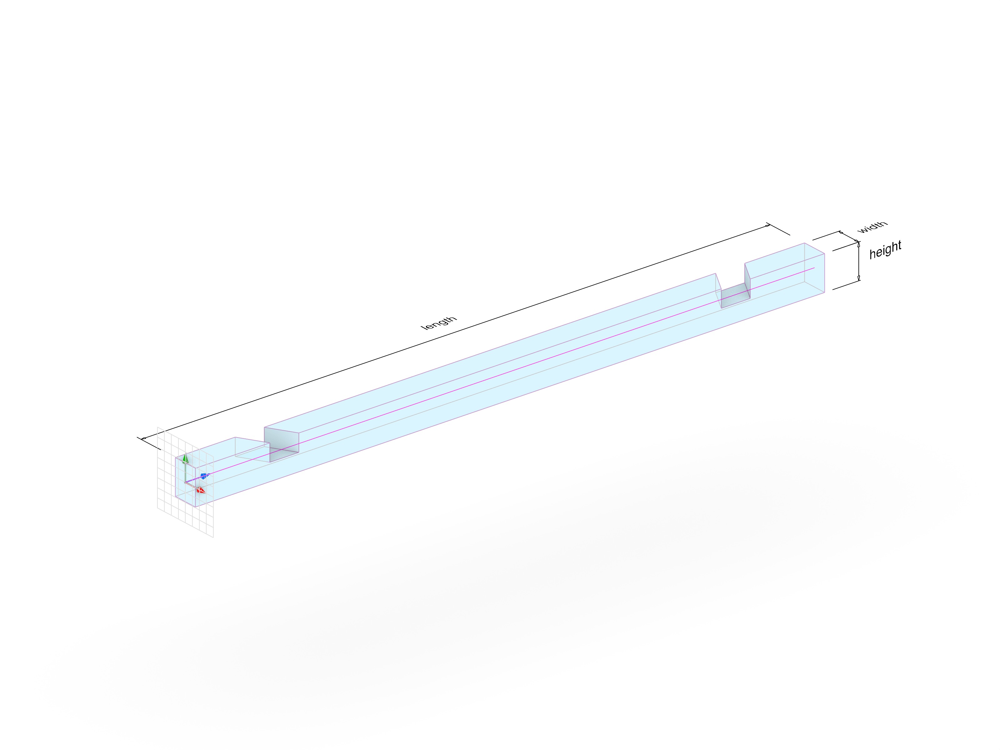
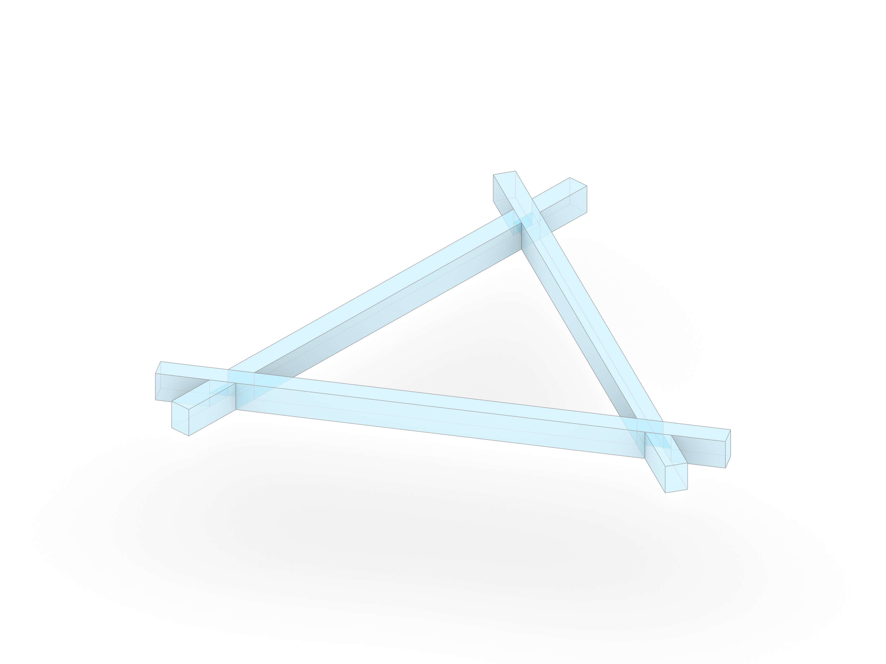
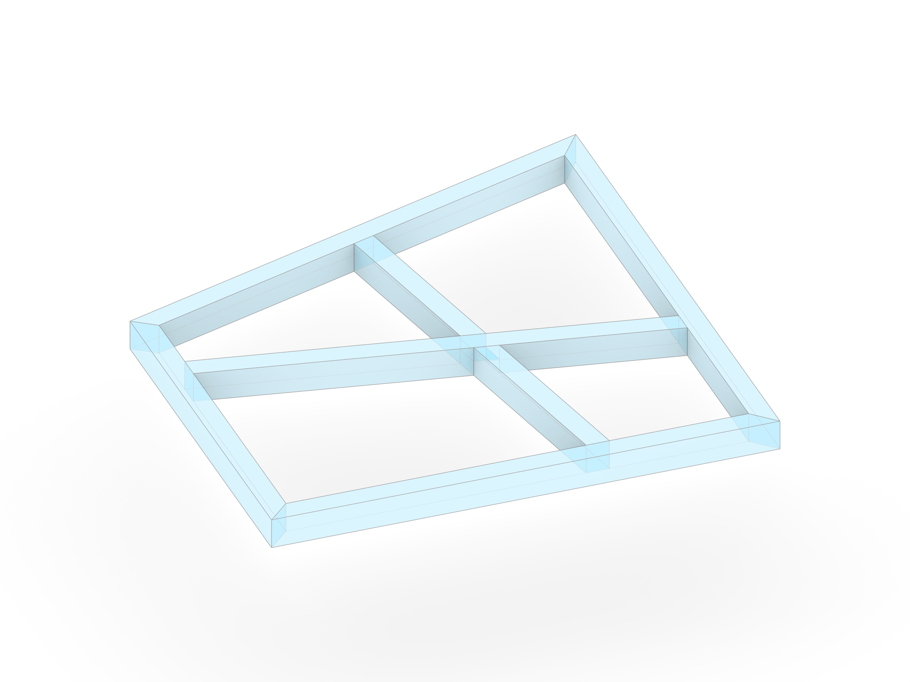
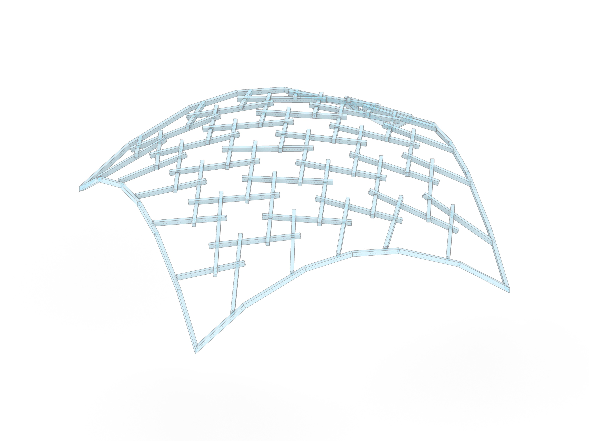

# Assignment 00 (Ungraded)

> **Goal:** Familiarize yourself with `compas` and `compas_timber` by creating a manually constructed reciprocal frame node and transitioning to an automated, rule-based workflow using a custom class.

In class, we will go through the basic cases of setting up a timber model, direct joint assignments, and joint rules. This assignment bridges these concepts by tasking you with the development of a `TimberModelCreator` class that will contain methods to create timber models. This class will be extended and used throughout the course.

## Exercise Steps

We have provided a Grasshopper file (`a00_compas-timber_starting_point.ghx`) that contains the starting components for each part of the assignment.

### Part 1: Manual Construction

Construct a simple reciprocal frame (RF) node to understand the fundamental components of a COMPAS Timber model.

1.  Open `a00_compas-timber_starting_point.ghx` in Rhino/Grasshopper.
2.  Locate the group labeled **Direct Joint Assignments**.
3.  Double-click the Python component to open the editor.
4.  Complete the code inside to:
    *   Creating beams from lines (`Beam.from_centerline`).
    *   Manually placing joints (`XLapJoint.create`).

### Part 2: Rule-Based Logic

Transition from manual assignments to rule-based automation.

1.  Locate the group labeled **Topology** in the Grasshopper file.
2.  Open the Python component and complete the code to use:
    *   **Topology Rules**: Defining rules based on intersection types (X, T, or L shapes).
    *   You can use the other two rule examples provided in the code right above.

### Part 3: Automated Workflow with Classes

To prepare for more complex structures, you will implement/extend a helper class called `TimberModelCreator` in an external Python file, and then use it inside Grasshopper.

1.  **The Class**:
    *   Open `a00_timber_model.py` in VS Code.
    *   Implement the missing methods: `create_beams`, `add_topology_rules`, and `apply_rules`.

2.  **The Script**:
    *   In Grasshopper, locate the group labeled **COMPAS Timber Model - From Lines**.
    *   The Python component there is already set up to import your class.
    *   Run the component (or press the button) to verify your class generates the model correctly.

> **Note:** If you make changes to the `.py` file while Grasshopper is running, the code should update automatically thanks to a feature of COMPAS for auto reloading.

### Expected Output
- A functional reciprocal frame unit consisting of three beams.
- Correct joinery at all beam intersections.
- A clean geometric output visualized in Rhino.

### Resources

- [COMPAS API Reference](https://compas.dev/compas/2.15.0/api/index.html)
- [COMPAS Timber documentation](https://gramaziokohler.github.io/compas_timber/1.0.4/)
