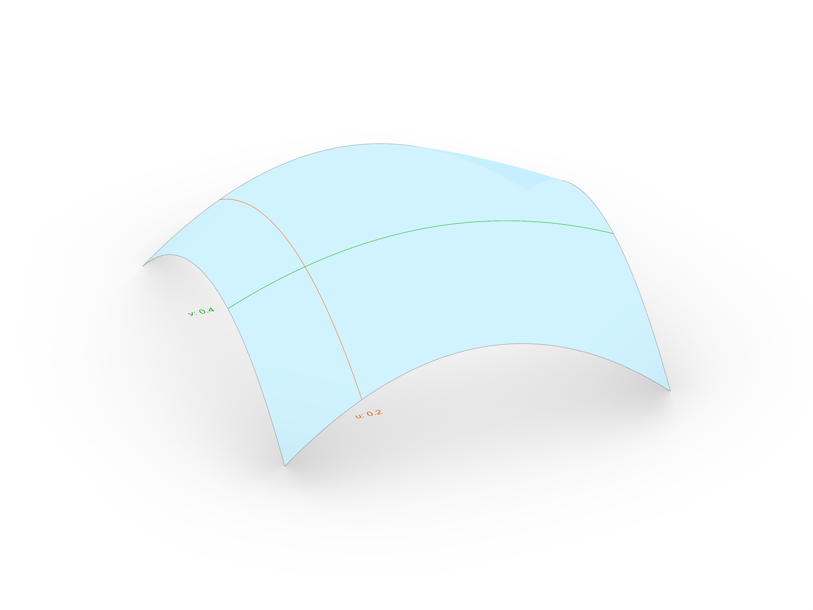
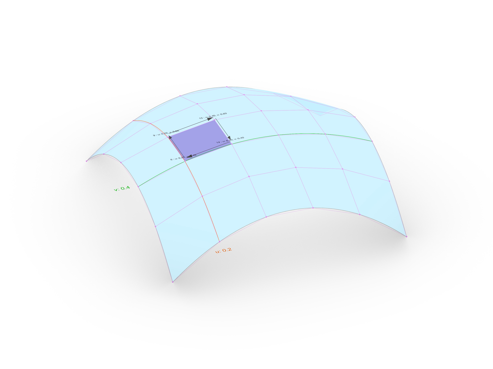
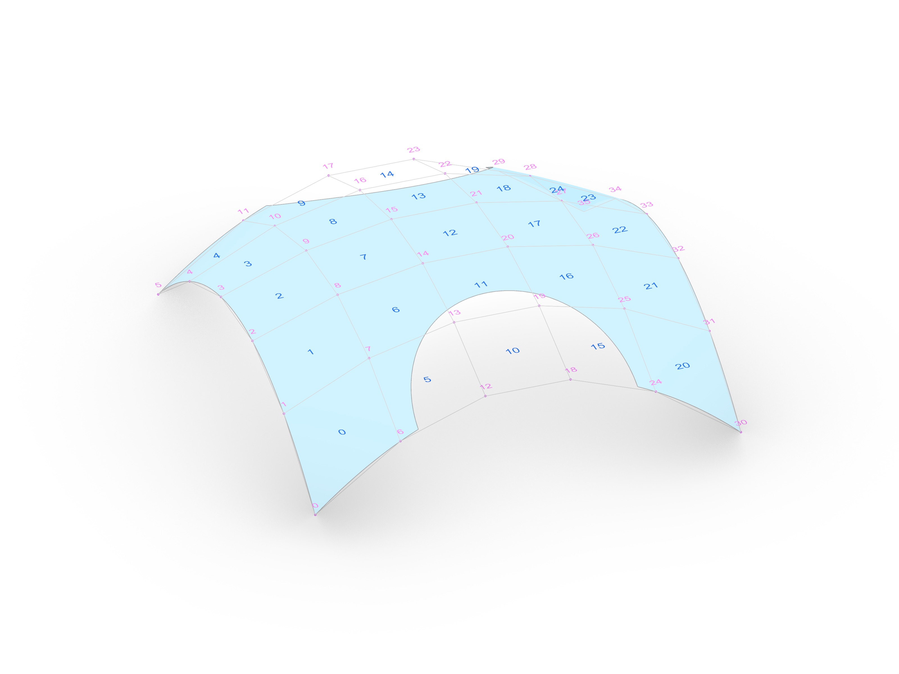
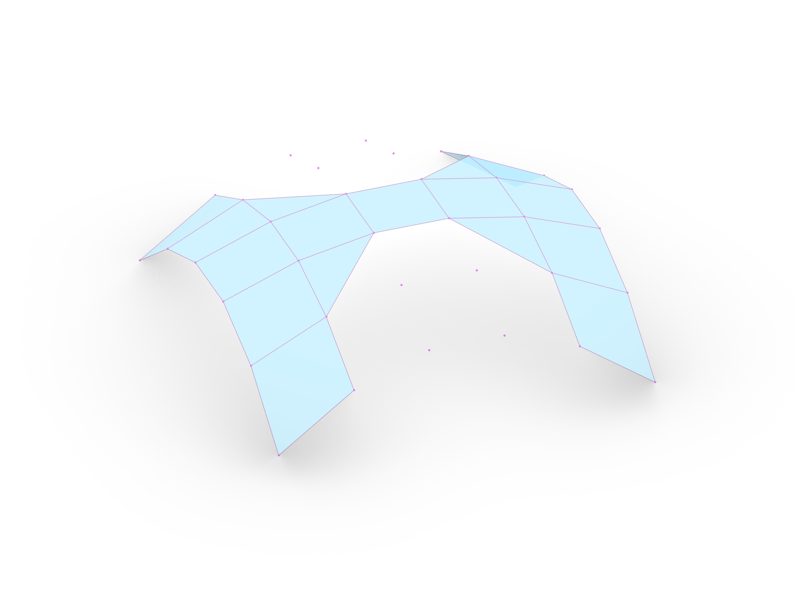
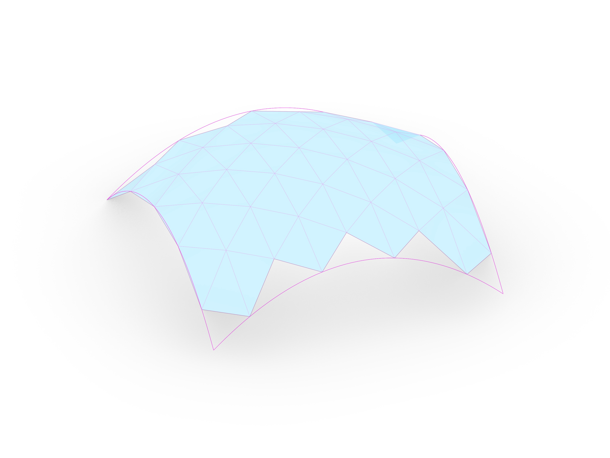

# Assignment 01: Brep Mesher + Reciprocal Frame

> Goal: build a UV-based mesher for a Rhino Brep and use the resulting mesh as the topology for a reciprocal-frame structure materialized with COMPAS Timber.

Your starting point is [`a01_brep-mesher.ghx`](a01_brep-mesher.ghx). It includes a scaffold and in-place guidance comments. This line-by-line guidance can be ignored if desired to implement in a different way.

<!--  -->

## Learning Goals

By the end of this assignment, you should be able to:

- Sample a Brep surface in UV space.
- Build a `compas.datastructures.Mesh` from sampled points.
- Filter mesh faces against a trimmed Brep boundary.
- Store custom attributes on mesh edges (`centerline`, `normal`, `next_edge`, `prev_edge`).
- Convert abstract geometry (lines) into timber elements (`Beam`) and joint logic (`JointRule`s).

## Assignment Overview

The assignment is split into three layers in three separate Python files:

1. Meshing (`a01_mesher.py`)
   - Build a mesh from a single-face Brep.
   - Start with the quad mesher.
   - Optionally extend to other topologies.
2. RF logic (`a01_rf_system.py`)
   - Use mesh edges as reciprocal-frame beams.
   - Compute edge-to-edge relationships and editable centerlines.
3. Timber model (`a01_timber_model.py`)
   - Following up on A00, this version of `TimberModelCreator` is designed to work with the RF system instead of just lines.
   - Turn RF centerlines into beams.
   - Apply joint rules and process joinery.

### Main Task

- Create a `QuadMesher` class:
   - The class should take a Rhino Brep as input and generate a `compas.datastructures.Mesh`.
   - Focus on creating a **Quad Mesh** that follows the surface's UV logic.
- Integrate the mesh into the `RFSystem`:
   - Use the mesh faces to define the centerlines of a reciprocal frame.
   - Ensure that each edge carries the necessary attributes: `centerline`, `normal`, and connectivity (`next_edge`, `prev_edge`).
- Materialize with `compas_timber`:
   - Implement the `TimberModel` logic to convert the RF system into a 3D timber structure.
   - Use appropriate `JointRules` or direct joint assignments for `XLapJoint`, `TButtJoint`, and `LMiterJoint` (or explore other joint types available in the `compas_timber` library).
- Topics: Brep geometry, Mesh datastructures, Reciprocal Frames, COMPAS Timber Model.

### Challenge 01

- Vertex-On-Face: Implement a method to check if a generated mesh vertex actually lies on the Brep's face to allow for trimmed surfaces or surfaces with holes.
- Topics: Geometry (Point in surface, Closest point), Brep topology.

  
  

### Challenge 02

- Alternative Topologies: Add `TriMesher` and/or `HexaMesher` class implementations.
- Reuse as much logic as possible (sampling, filtering, cleanup).
- Test whether your RF logic still works with different valencies.
- Topics: Mesh subdivision, Dual meshes, Hexagonal grids.

  
  

## Deliverables

One zip file [`mustermann_max_A-01.zip`] containing:

- Grasshopper File (`.ghx`)
  - File Name: `mustermann_max_A-01.ghx`
- All python files (`.py`):
  - `a01_mesher.py`
  - `a01_rf_system.py`
  - `a01_timber_model.py`
- Screenshots (`.png`)
  - File Name: `mustermann_max_A-01_xx.png`
  - Dimensions: `3200 x 2400 px`
  - View: `Parallel`, `Shaded`

## Submission

Upload the assignment via POLY.GRADE