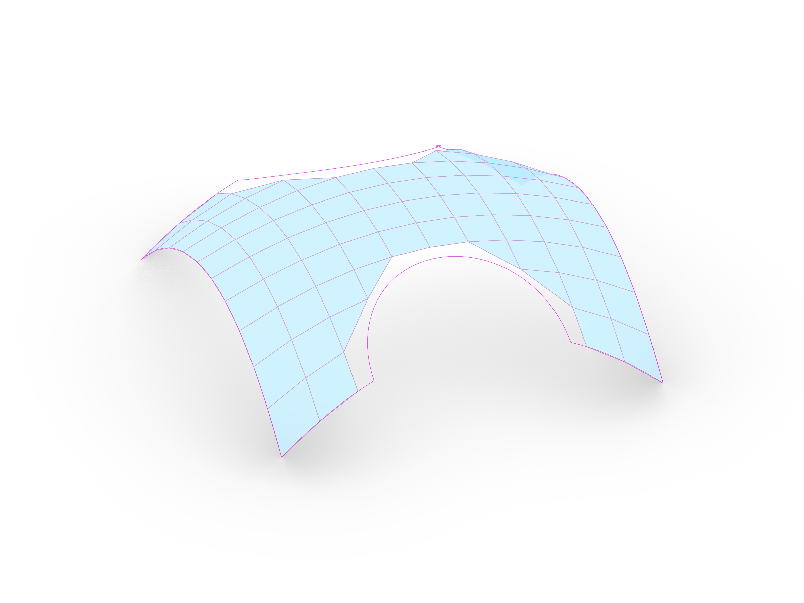
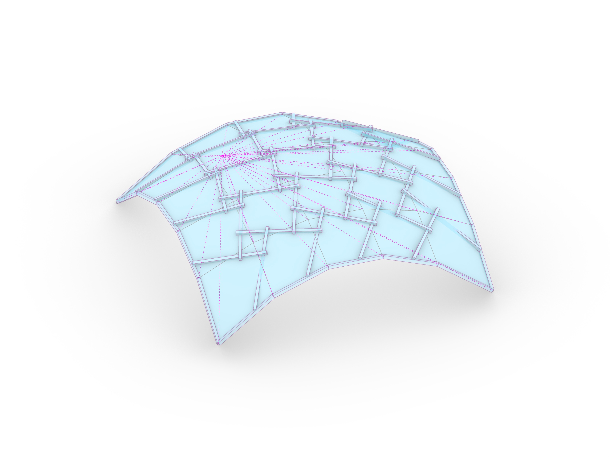
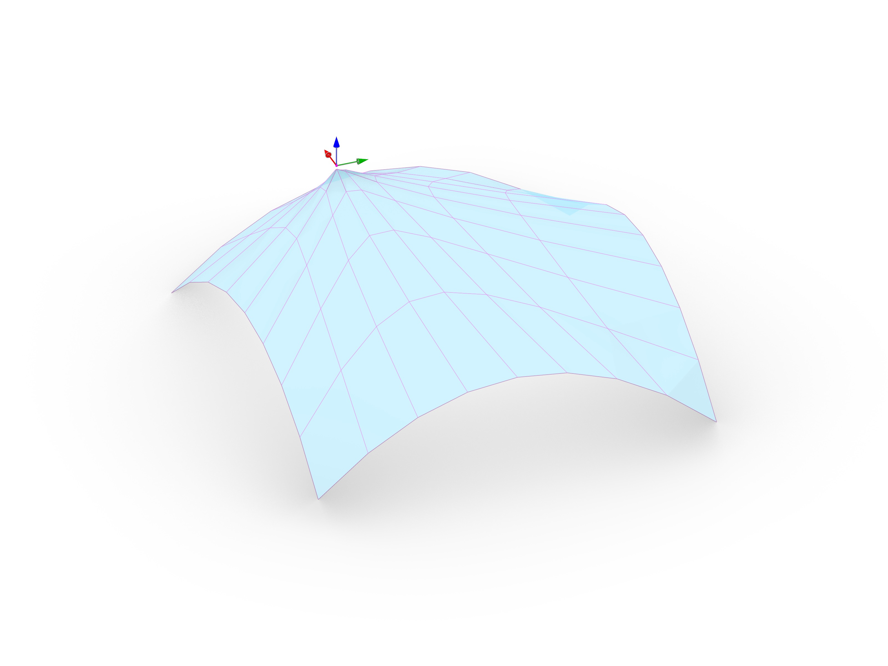

# Assignment 02: Mesh Relaxation + Reciprocal Frame

> Goal: Create a `MeshRelaxer` class to perform iterative spring-based relaxation on a mesh, ensuring it stays within boundary constraints and snaps to a target surface. This relaxed mesh will serve as the refined geometry for your Reciprocal Frame system.

Your starting point is [`a02_mesh-relax.ghx`](a02_mesh-relax.ghx). It includes a scaffold and in-place guidance comments. This line-by-line guidance can be ignored if desired to implement in a different way. Most of the coding work will be done in the Python files, but the Grasshopper file will be used to call the code in the Python files.

## Learning Goals

By the end of this assignment, you should be able to:

- Implement an iterative solver for mesh relaxation.
- Compute interior, boundary, and corner forces to manipulate mesh vertices.
- Apply constraints such as snapping vertices to a target NURBS surface.
- Dynamically adjust geometry using attractor points and curves.
- Design a modular system using classes (Modifiers).

## Assignment Overview

**Important Starting Note:** For files that build upon the previous assignment (`a02_mesher.py` and `a02_timber_model.py`), you have two options:
1. **Continue with your own work**: Copy your completed code from the corresponding A01 files into the new A02 files.
2. **Use our provided solutions**: Rename the provided solution files (e.g., `a02_mesher_solved.py`) to replace the blank starter files (e.g., `a02_mesher.py`).

The assignment is split into five separate Python files:

1. Meshing (`a02_mesher.py`)
   - Re-use or adapt your mesher from A01.
2. Mesh Relax (`a02_mesh_relax.py`)
   - Main mesh relaxation logic.
3. Modifiers (`a02_modifiers.py`)
   - Contains custom logic to influence the relaxation dynamically.
4. RF logic (`a02_rf_system.py`)
   - Manages eccentricity, centerlines, and attractor logic for the Reciprocal Frame.
5. Timber model (`a02_timber_model.py`)
   - Turns the relaxed RF centerlines into a 3D timber structure with proper joints.

### Main Task

- Implement the relaxation logic in the `MeshRelaxer` class:
   - **Iterative Solver:** Create a `relax` method that runs for a specified number of iterations.
- Implement one or more of the following forces and constraints that influence the relaxation:
   - **Interior Forces:** Compute forces that move each vertex toward the average position of its neighbors (Laplacian smoothing).
   - **Boundary Forces:** Implement logic to pull boundary vertices toward a target `Polyline` boundary.
   - **Corner Forces:** Identify and lock corners or pull them toward specific anchor points.
   - **Surface Snapping:** Ensure vertices are projected back onto a reference `NurbsSurface` after each relaxation step.
- Topics: Iterative solvers, Vector arithmetic, Mesh smoothing, Constraint satisfaction.

<!--  -->

### Challenge 01

- Geometric Eccentricity: Extend the `RFSystem` class and implement methods to eccentrize the RF centerlines based on **attractor points** or **attractor curves**. The eccentricity (offset) should vary dynamically depending on the distance to these attractors. You will also need to add a bit of code in the Grasshopper file to use your new methods.
- Topics: Attractor logic, Distance-based mapping.

### Challenge 02

- Custom Modifiers: We will implement an extensible system to add custom behavior to the relaxation process. This will be done by wrapping each modifier logic into a class and the applying those modifications from the `MeshRelaxer` code. The task is to create at least one custom modifier. Examples include:
   - **Point Attractor Modifier:** Pulls specific parts of the mesh toward a point in space during relaxation.
   - **Uniform Direction Modifier:** Applies a constant force (e.g., gravity or wind) to the vertices.
- Each modifier class should respect a common interface (ie. the same method name and input/output parameters) so that they can be easily added or removed from the relaxation process. In particular, each modifier should have an `apply(self, relaxer, mesh)` method that takes the relaxer and the mesh instances and applies whatever logic it needs to apply to the mesh.
- You can use the examples in the lecture and integrate them into your assignment, or create new classes.
- Topics: Modular code design, Modifier classes.

## Deliverables

Submit the following files:

- Grasshopper File (`.ghx`)
  - File Name: `mustermann_max_A-02.ghx`
- All python files (`.py`):
  - `a02_mesher.py`
  - `a02_mesh_relax.py`
  - `a02_modifiers.py`
  - `a02_rf_system.py`
  - `a02_timber_model.py`
- Screenshots (`.png`)
  - File Name: `mustermann_max_A-02_xx.png`
  - Dimensions: `3200 x 2400 px`
  - View: `Parallel`, `Shaded`

## Submission

Upload the assignment via POLY.GRADE