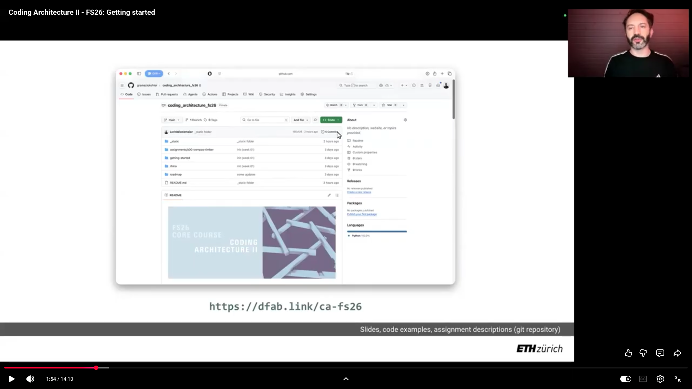

# Getting Started

## Software requirements

Before you begin the installation of the tools required for this course, make sure you have the following pre-requisites installed on your system:

* Rhino 8: https://www.rhino3d.com/download
* VS Code (free): https://code.visualstudio.com/
* GIT (free): https://git-scm.com/

> NOTE: On Mac, GIT is usually pre-installed, you do not need to install again. To check if it is installed, open a terminal window and type `git`, if the result does not indicate any error, it means you already have it in your system.

Once that is done, follow the installation instructions with this step-by-step video:

[]([TODO](https://youtu.be/a2k6VeNUShg))

**Troubleshooting**

If you encounter issues during the installation, try to restart Rhino and retry. If the problem persists, contact your tutor.

---

## Technical Setup for VS Code (Advanced)

While the main course content runs in Rhino/Grasshopper, we recommend setting up a proper Python environment for editing code in VS Code. This gives you autocompletion, error checking, and the ability to run scripts directly.

We use [`uv`](https://docs.astral.sh/uv/) for this. It is a fast tool to manage Python installations.

### 1. Install `uv`

Follow the [official install guide](https://docs.astral.sh/uv/getting-started/installation/) to install `uv` on your machine.

### 2. Open Project in VS Code

Open the folder where you cloned the repository in VS Code.

### 3. Setup Environment

1.  Open a new terminal inside VS Code (`Terminal > New Terminal`).
2.  Run the following command to download and install all necessary tools and libraries:

    ```bash
    uv sync
    ```

    This creates a hidden `.venv` folder in your project with everything ready.

### 4. Configure VS Code

To make VS Code understand your code (fix missing imports, enable autocomplete):

1.  Open the Command Palette (`Cmd+Shift+P` on Mac, `Ctrl+Shift+P` on Windows).
2.  Type and select: `Python: Select Interpreter`.
3.  Select the **recommended** environment (it should point to `./.venv/bin/python` or similar).

    > If you don't see it, choose "Enter interpreter path...", navigate to the project folder, and select `.venv`.
