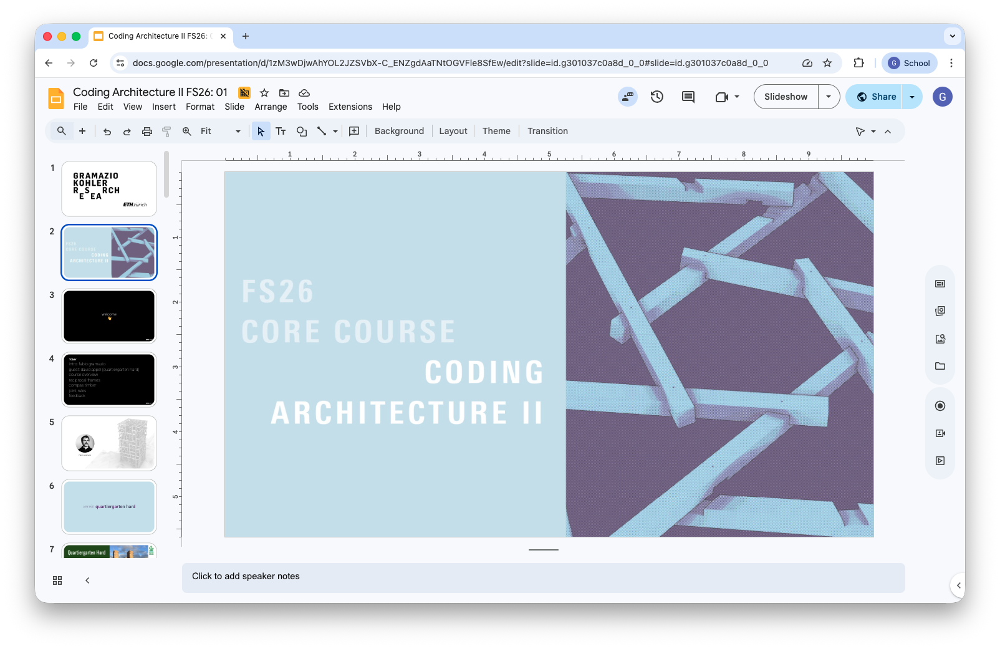
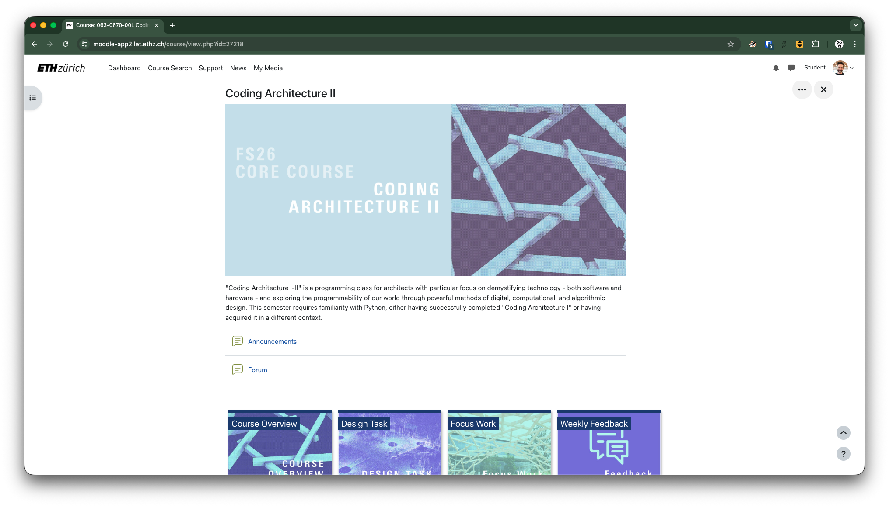

# Coding Architecture II: FS26
 
## Week 01 - Reciprocal Frames with compas_timber

## Table of Contents

- [Introduction](#introduction)
- [Overview](#overview)
- [Team](#team)
- [Slides](#slides)
- [Course Administration](#course-administration)
  - [Semester Structure](#semester-structure)
  - [Room](#room)
  - [Moodle](#moodle)
  - [Tutoring Groups](#tutoring-groups)
  - [Grading](#grading)
  - [Assignments](#assignments)
  - [Software Requirements and Installation](#software-requirements-and-installation)
- [Assignment A00](#assignment-a00)
- [First Main Topic](#first-main-topic)
  - [Roadmap Recap](#roadmap-recap)
- [Teaching Material](#teaching-material)
  - [Foundational Material](#foundational-material)
  - [Rhino](#rhino)
  - [Grasshopper](#grasshopper)
  - [Python](#python)
  - [COMPAS](#compas)
  - [Books](#books)
  - [Video recordings](#video-recordings)

## Introduction

**Coding Architecture II** is a programming class specifically designed for architects. The course focuses on demystifying technology — both software and hardware — and exploring the programmability of our world through digital, computational, and algorithmic design methods, enabling architects to grasp the fundamental principles and practical applications within our increasingly digital world.

This course is an entry point into the world of programming, with a specific emphasis on its application in architecture. You’ll learn how to use Python as the primary programming language, and we’ll work extensively with Rhino and Grasshopper to bridge the gap between text-based coding and 3D modeling. 

## Overview

Throughout the course, you will:

- Develop an understanding of essential programming concepts and algorithmic thinking.
- Learn to apply digital and computational methods in architectural design.
- Improve your problem-solving abilities by creating algorithmic solutions.
- Work on materializing your digital designs into the physical world.

Lectures, tutorials, and exercises will cover:

- Object-Oriented Programming (OOP)
- Geometry and data structures
- Design to Fabrication workflows

This course welcomes students from all backgrounds, but this semester requires familiarity with Python, either having successfully completed "Coding Architecture I" or having acquired it in a different context.

## Team

## Slides

    

        ↑ click to open ↑
    

## Course Administration

### Semester Structure

The semester structure for Coding Architecture II is designed to progressively build your skills in programming and computational design. The course begins with the use of COMPAS Timber for simple timber frame structures, and then moves on to geometric algorithms and reciprocal frames with COMPAS Timber.

Assignments are strategically spaced throughout the semester, starting with simpler tasks like constructing a simple timber reciprocal frame, and advancing to more challenging projects, culminating in a final project that integrates all the learned skills. The schedule also includes tutored sessions and review periods, providing sufficient opportunity for guided practice and feedback.

### Room

The course “Coding Architecture II” will take place on Thurdays from 13:45-16:30 in room **HPT C 103**.

> Please note:  We will try to provide as many powerplugs as we can, but we may not be able to cover the entire room! We kindly request that you bring your laptops fully charged to each session.

### Moodle

Moodle will serve as our primary teaching platform. From there, you will access all course materials, relevant administrative information, download and submission links, and quizzes. Additionally, Moodle hosts the course forum, where you can ask questions and engage in discussions with your peers and instructors.

Follow this [LINK](https://moodle-app2.let.ethz.ch/course/view.php?id=27218) to access to the Moodle course plattform.

### Tutoring Groups

To ensure a smooth learning experience, we have assigned tutors who will act as your points of contact throughout the semester. They will be available to assist you with any content-related or administrative questions you may have. We highly recommend signing up for a tutor on Moodle as soon as possible.

LINK: [Moodle: Tutor Selection](https://moodle-app2.let.ethz.ch/mod/choicegroup/view.php?id=1348397)

### Grading 

- Individual Work (Assignment A01, A02)
- Group Work (Assignment A03)

See [here](https://moodle-app2.let.ethz.ch/course/section.php?id=239397) for details about the grading process and your requirements.

### Assignments

The course includes three major assignments that progressively increase in complexity, allowing you to test and improve your programming abilities. These assignments cover a range of topics, from basic list and loop operations to object-oriented programming. The culmination of the assignments is a final project where you will design a timber structure set to be built in the city of Zürich during the Focus Work period. It is recommended to complete the assignment submissions well in advance of the review session deadline.

### Software Requirements and Installation

See [here](../../getting-started/README.md) for details about software requirements and installation of the tools.

## Assignment A00

In this first assignment, you will familiarize yourself with `compas` and `compas_timber` by creating a manually constructed reciprocal frame node and transitioning to an automated, rule-based workflow using a custom class.

**This is an ungraded assignment.**

- [Assignment A00 Description](../../assignments/A00-compas-timber/README.md)

## First Main Topic

### Roadmap Recap

The "becoming a computational designer" roadmap is a comprehensive guide that outlines the necessary steps to becoming proficient in computational design. It covers foundational concepts such as data and algorithms, as well as more advanced topics. The roadmap also provides visual references, with equivalent concepts in Grasshopper highlighted in green and programming concepts highlighted in blue below:

See [here](../../roadmap/README.md) for more information about the **Roadmap: becoming a computational designer**.

    

        ↑ click to view ↑
    

___

## Teaching Material

We have compiled a list of essential links and resources to support your learning throughout the semester. These materials cover foundational topics in programming, computational geometry, visual programming, Rhino, and Grasshopper. You will also find API references that include the methods, classes, and functions needed for your assignments and projects. Additionally, we've included a selection of books and other resources to help you deepen your understanding of the course topics. These resources are intended to provide you with the necessary tools and information as you progress through the course.

### Foundational Material

- [Essentials of Parametric Design](https://gramaziokohler.arch.ethz.ch/teaching-materials/01_essentials/)

### Rhino

- [Rhino User Guide](https://docs.mcneel.com/rhino/8/usersguide/en-us/index.htm)
- [Rhino Command List for 3D Modelling](https://docs.mcneel.com/rhino/8/help/en-us/commandlist/command_list.htm)
- [RhinoScript Syntax](https://developer.rhino3d.com/api/RhinoScriptSyntax/)
- [RhinoCommon API Reference](https://developer.rhino3d.com/api/rhinocommon/?version=8.x)
- [Rhino Python Guide](https://developer.rhino3d.com/guides/rhinopython/)

### Grasshopper

- [Grasshopper Guides](https://developer.rhino3d.com/guides/grasshopper/)

### Python

- [Python 3.9 Reference](https://docs.python.org/3.9/)
- [Python Roadmap](https://roadmap.sh/python)
- [Python Cheat Sheet](https://learnxinyminutes.com/python/)

### COMPAS

- [COMPAS API Reference](https://compas.dev/compas/2.15.0/api/index.html)
- [COMPAS Timber documentation](https://gramaziokohler.github.io/compas_timber/1.0.4/)

### Books

For online access using your ETH Account, you have to be in the ETH network or VPN.

- [Geometric Computation: Foundations for Design](https://www.taylorfrancis.com/books/mono/10.4324/9781315765983/geometric-computation-foundations-design-joy-ko-kyle-steinfeld). Ko, Joy, and Kyle Steinfeld. London: Routledge, 2018.
Online access with ETH Account: Link
[ Copy available at ETH Architecture and Civil Engineering Library ]  ISBN : 1-317-65907-4
- [Morphing: a Guide to Mathematical Transformations for Architects and Designers](https://www.oreilly.com/library-access/?next=/library/view/morphing/9781780677224/). Choma, Joseph. London: Laurence King Publishing, 2015.
Online access with ETH Account: Link
[ Copy available at ETH Architecture and Civil Engineering Library ] ISBN : 1780674139
- [AAD_algorithms-Aided Design: Parametric Strategies Using Grasshopper®](https://www.arturotedeschi.com/books). Tedeschi, Arturo, and Fulvio Wirz.  Brienza (Potenza): Le Penseur, 2020.
ISBN : 9788895315300
- [Digital Media Series: Grasshopper](https://www.jinmorhee.net/jinmorhee_2-multiimage/dmsgrasshopper.html). Jinmo Rhee, Eddy M. Kim. Independently published. ISBN :  979-8650408130

### Video recordings

The lecture recordings will be available on the ETH Video Portal to serve as reference, however, presence during lectures is required.

---

