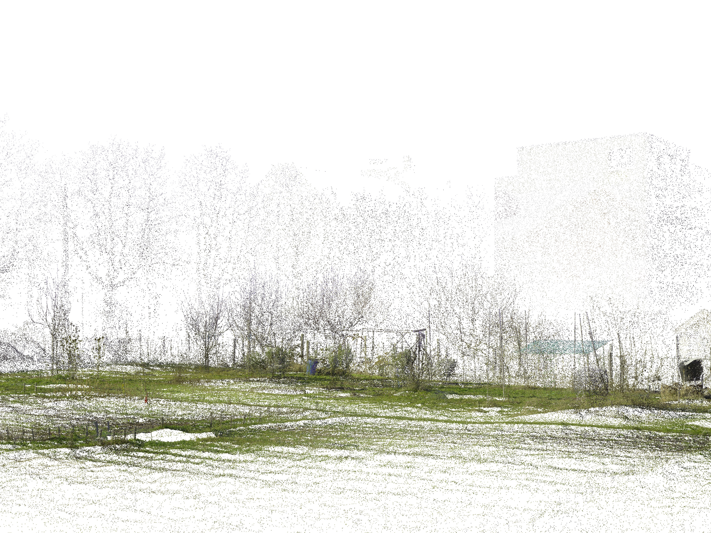
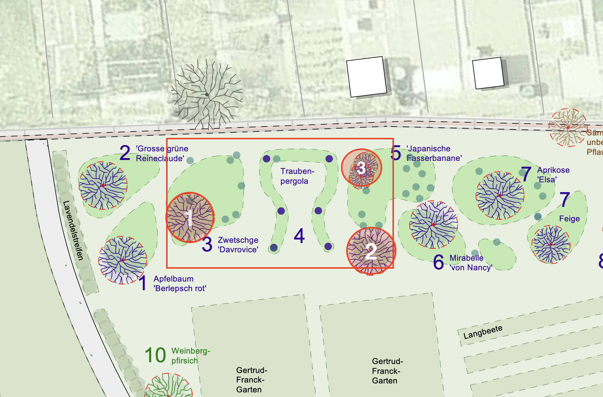
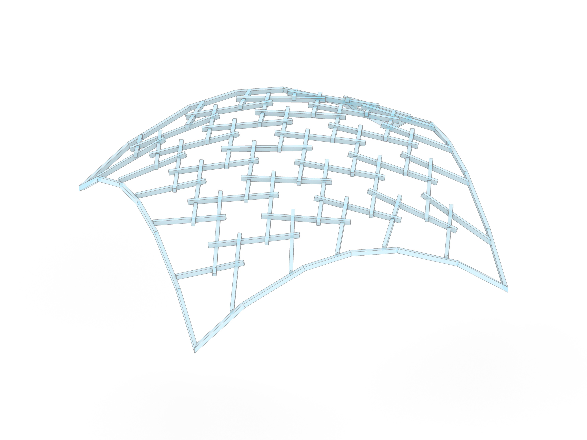
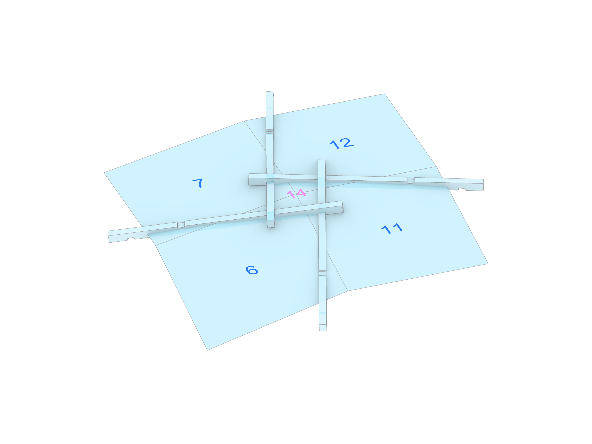

# Coding Architecture II: FS26

## Week 02 - Reciprocal Frame Systems & Brep Meshing


## Table of Contents

- [Introduction](#introduction)
- [Design Process](#design-process)
- [Poly.grade](#polygrade)
- [OOP Recap](#oop-recap)
- [RF Systems](#rf-systems)
- [Mesh to rf_system](#mesh-to-rf_system)
- [Brep Meshing](#brep-meshing)
- [Assignment A01: Brep Mesher](#assignment-a01-brep-mesher)
- [Slides](#slides)
- [Examples](#examples)

## Introduction

In this week's lecture, we transition from the general course setup to concrete design and technical workflows. We focus on two main pillars: setting the stage for the **Design Project** and deepening our **Computational Foundation**.

We will discuss the updated project perimeter and site requirements for the *Quartiergarten Hard*, establish the group design process, and walk through the submission workflow on POLY.GRADE. 

Technically, we dive into the logic of **Reciprocal Frame (RF) Systems**. We will explore how to bridge the gap between abstract geometry and timber construction by creating custom mesh-generating algorithms (Brep Meshing) and converting these meshes into structural systems where every beam is logically linked to its neighbors.

## Design Process

The design process evolves in parallel with individual coding assignments (A01, A02) until the integration phase in Assignment A03.

### Key Milestones
- **05.03**: Design session (Group formation)
- **26.03**: Table review (with Jesus Medina)
- **02.04**: A03 Handout (Integration of design and code)
- **16.04 – 07.05**: Continuous table reviews and guest critiques



### Project Parameters (Update)
- **Perimeter**: Extended by 2.5m north-east (see [ca2_rhino-file_light.3dm](https://moodle-app2.let.ethz.ch/mod/resource/view.php?id=1354766)).
- **Regulations**: Review boundary distances according to *Gartenordnung Zürich (GOZ)*.
- **Vegetation**: Preserve trees 1, 2, and 3. Any removal requires detailed justification.



## Poly.grade

[POLY.GRADE](https://polygrade.arch.ethz.ch/) is the central platform for all assignment submissions and grading.

1. **Access**: Log in to the *Student Portal* using your credentials.
2. **Overview**: View your course, current assignments, and the schedule.
3. **Submission**: Upload files to the specific assignment page. The latest version before the deadline is graded.
4. **Feedback**: View grades and submission status once published.

Further details are available on Moodle.


## OOP Recap

Object-Oriented Programming (OOP) is a paradigm that allows us to structure our code by grouping data and functionality into logical units.

### Classes vs. Objects

- **Classes (Blueprints)**: Simple, reusable pieces of code. They represent abstract, broad categories that share attributes and define the types of those attributes. They contain functions called **methods**.
- **Objects (Instances)**: Specific, concrete individual instances of a class. They are created based on the blueprint and have specific values assigned to their attributes.

### Defining Data & Behavior

In Python, we use the `class` keyword to define new types. This allows us to define both **Data** (what the object knows/is) and **Behavior** (what the object can do).

#### Example: The Room Class

```python
class Room:
   def __init__(self, name: str, width: float, depth: float):
       # Data / Attributes
       self.name = name
       self.width = width
       self.depth = depth

   # Behavior / Method
   def scale(self, factor: float) -> None:
       self.width *= factor
       self.depth *= factor
```

### Key Concepts

- **Data**: Represented by **attributes** (e.g., `self.width`). These are variables that belong to the object.
- **Behavior**: Represented by **methods**. These are functions defined inside a class that operate on its data.
- **Magic Methods**: Special methods that start and end with double underscores (dunder). The most important one is `__init__`.
- **Constructor (`__init__`)**: A special magic method that is called automatically when a new object is created. It initializes the object's attributes.
- **Properties**: Allow you to define methods that can be accessed like attributes, often used for data validation or computed values.
- **Optional Parameters**: You can provide default values in methods (e.g., `def scale(self, factor: float = 1.0)`).
- **Type Hints**: Using `: str`, `: float`, and `-> None` helps with code clarity and allows IDEs like VS Code to provide better linting and autocomplete.

## RF Systems

**Reciprocal Frames (RF)**, often referred to as *Hebelstabwerke*, are surface structures consisting of individual beam elements that are connected to each other via spatial interlocking, which is referred to as an **overlap**.

### The Principle of Reciprocity
The fundamental characteristic is mutual support: at least three elements rest on each other in such a way that each element is supported at one end by another and itself serves as a bearing for the next one.
- **Configuration**: The number of slats $n$ is mirrored in a central $n$-gon (polygon) at the center of the configuration.
- **Static Logic**: The construction is self-stabilizing through cyclic loading and its own dead load. Historically, this principle allowed architects to span large areas using timber beams that were shorter than the overall span.

### Terminology & Analogy
The term is derived from the Latin *reciprocus* (mutual or alternating). In research and practice, various descriptions exist, such as *Nexorades*, *Mutual Supporting Element Systems (MSE)*, or *Mandala Roofs* in traditional carpentry. Structurally, RF systems share a strong affinity with **weaving and plaiting techniques**, though they consist of short, discrete elements rather than continuous strands.



## Mesh to rf_system

Transforming a conventional lattice (mesh) into a reciprocal system involves "opening" the nodes to create the characteristic overlapping pattern.



### Node Aperture
Unlike a standard reticulated framework where members meet at a single point, the nodes in an RF system are opened via two key operations:
1. **Rotation (Eccentricity)**: The slats are shifted tangentially relative to the vertex, creating a central aperture.
2. **Extension**: The centerlines are extended beyond the geometric intersection points to ensure proper support and provide enough material for joinery.

In our computational workflow, this shift is driven by the underlying **tessellation** of the mesh. Each edge is enriched with a logical link to its `next_edge` and `prev_edge`, establishing a closed structural circuit across the surface.

## Brep Meshing

Before creating an RF system, we need a clean mesh. Since we want to work with NURBS surfaces or BReps for intuitive design control, we will write a custom **QuadMesher** to automate the discretization process based on UV evaluation.


### UV Space Evaluation
The core of the mesher is the evaluation of the surface domain ($u$, $v$). By dividing the domain into a grid of coordinates, we can map any $(u, v)$ pair back to a 3D point on the surface:
$$P = S(u, v)$$

### Mesh Face Generation
To generate a mesh from a surface, we follow these steps:
1. Generate a regular grid of vertices in UV space.
2. Traverse the points in a specific order (e.g., $u_0, v_0 \to u_0, v_{0.2} \to u_{0.2}, v_{0.2} \to u_{0.2}, v_0$) to define a single face.
3. Repeat this process for the entire grid to construct all faces.

### Dealing with Trimmed Surfaces
The surfaces you design might be "trimmed" or have irregular boundaries. Our mesher handles this by:
1. Checking `is_vertex_on_face` for each vertex to identify holes or boundary constraints.
2. Only constructing faces where all vertices lie within the valid area of the BRep face.

With this approach, you will be able to represent a wide variety of surfaces as a mesh to kickstart your design.

## Assignment A01: Brep Mesher

In the first graded individual assignment, you will implement a custom `QuadMesher` class to generate quad meshes from BRep surfaces. The goal is to create a robust topological foundation for an RF system, handling UV mapping, vertex validation for trimmed surfaces, and materializing the structure using `compas_timber`.

Detailed instructions and tasks can be found here:
[Assignment A01: Brep Mesher](../../assignments/A01-mesh-brep-rf/README.md)

## Slides

[Link to slides](https://docs.google.com/presentation/d/1jrOzz4Nt2Ey9Qhf4fyqZtHoP4pXTTEAtxOw0OLwYkMk/edit?usp=sharing)

## Examples

The examples for this week can be found in the assignment directory:

- [example-01-basic-rf-systems.ghx](../../assignments/A01-mesh-brep-rf/example-01-basic-rf-systems.ghx)
- [example-02-visualizer-components.ghx](../../assignments/A01-mesh-brep-rf/example-02-visualizer-components.ghx)