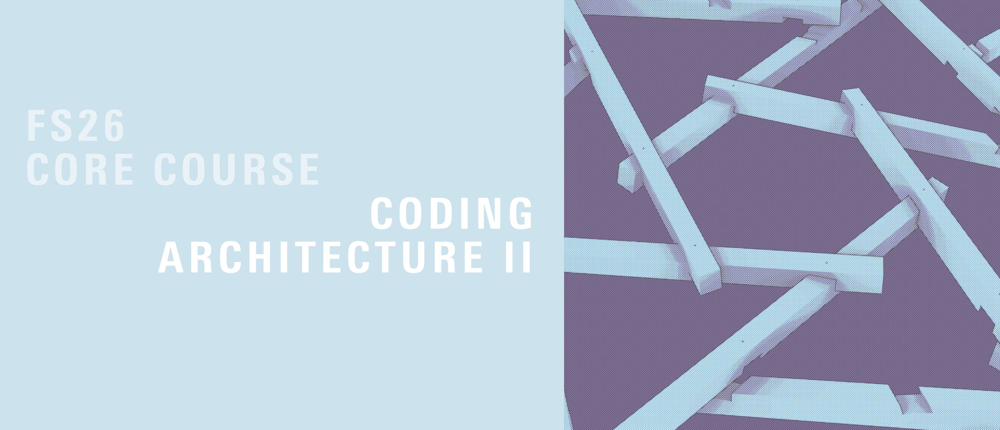
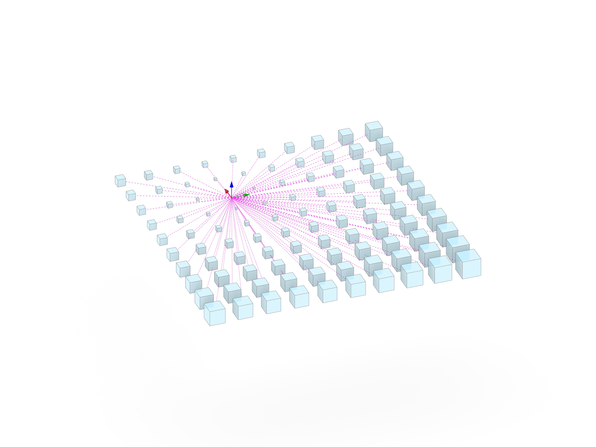
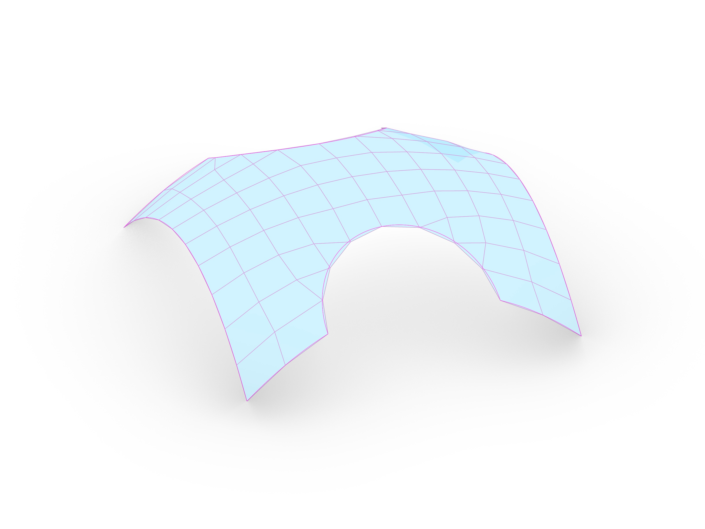
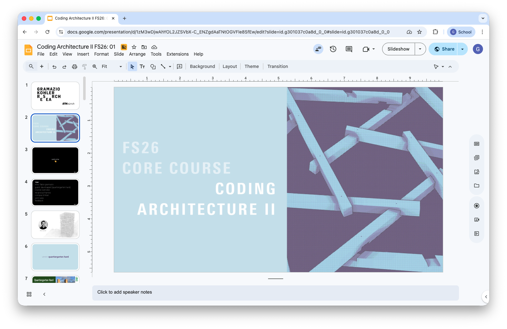

# Coding Architecture II: FS26

## Week 04 - Attractor Points & Object-Oriented Modifiers



## Table of Contents

- [Introduction](#introduction)
- [Review: Assignment 01](#review-assignment-01)
- [Attractor Points: Scaling](#attractor-points-scaling)
- [Attractors as Forces](#attractors-as-forces)
- [Mesh Relaxation](#mesh-relaxation)
- [Object-Oriented Modifiers](#object-oriented-modifiers)
- [Assignment A02](#assignment-a02)
- [Slides](#slides)
- [Examples](#examples)

## Introduction

This week, we bridge the gap between simple geometric transformations and complex iterative systems. We start by reviewing the logic behind Assignment 01 (Brep Meshing & RF Systems). We then explore the concept of **Attractors**- first as a tool for local geometric scaling, and then as a dynamic "force" within our mesh relaxation system. Finally, we will refactor our procedural code into an **Object-Oriented** structure using "Modifier" classes, setting the stage for the modular relaxer in Assignment A02.

## Review: Assignment 01

We will discuss the solutions for the Brep Mesher and the Reciprocal Frame (RF) system. 
- **UV Mapping:** How to reliably sample a Brep.
- **Topology:** Ensuring the mesh connectivity correctly represents the RF logic.
- **Timber Integration:** Translating abstract edge attributes into `compas_timber` beams and joints.

## Attractor Points: Scaling

Before using attractors in complex simulations, we look at the simplest case: **Distance-based Scaling**. 
- Calculating the distance between a grid of boxes and one or more attractor points.
- Mapping that distance to a scale factor.
- Using `compas.geometry` to transform geometry relative to its proximity to an influence source.



## Attractors as Forces

Building on last week's Mesh Relaxation, we introduce a new type of influence: the **Attractor Force**. 
Instead of just internal edge forces, we add an external vector that pulls mesh vertices toward a point (or pushes away from said point). This allows for "sculpting" the relaxed form by placing attractors in space.

## Mesh Relaxation

Mesh relaxation is an iterative process used to find an equilibrium state for a network of vertices and edges. It can be used in computational design for form-finding and optimization among others.



### Core Concepts

The relaxation process is based on the interaction of internal and external forces acting on each vertex of the mesh.

1. **Iterative Solvers**:
   Instead of calculating the final shape in one step, we move vertices incrementally. In each "step" or "iteration," we calculate the net force on a vertex and update its position.
   
2. **Spring Forces (Internal)**:
   Every edge in the mesh acts like a spring. 
   - If an edge is longer than its **target length**, it pulls the connected vertices together.
   - If it is shorter, it pushes them apart.
   - **Stiffness ($K$)**: Controls how strongly the spring reacts to the difference in length.

3. **Constraints (Boundary & Fixed)**:
   To prevent the mesh from collapsing into a single point and to fixate support points, certain vertices must be constrained.
   - **Fixed Vertices**: Vertices that cannot move (e.g., corner points).
   - **Boundary Constraints**: Vertices allowed to move only along a specific path (e.g., a boundary curve or Brep edge).

4. **Damping**:
   To prevent the system from oscillating infinitely or "exploding" due to high forces, we apply a damping factor (e.g., `0.95`) to the movement, slowing down the vertices over time.

### Implementation Logic

In our code, a `MeshRelaxer` object manages the simulation. The core logic of a single relaxation step can be summarized in three main actions:

```python
# The Core Logic of a Relaxation Step
for _ in range(self.iterations):
    
    # 1. Calculate Forces (Internal + External)
    # Each vertex calculates a vector pulling it toward its neighbors or attractors
    for vertex in self.mesh.vertices():
        force = calculate_spring_forces(vertex) + calculate_attractor_forces(vertex)
        self.mesh.vertex_attribute(vertex, "force", force)

    # 2. Update Positions
    # Move vertices based on their accumulated forces
    for vertex in self.mesh.vertices():
        if not vertex_is_fixed:
            force = self.mesh.vertex_attribute(vertex, "force")
            new_pos = current_pos + force * damping
            self.mesh.vertex_attributes(vertex, "xyz", list(new_pos))

    # 3. Constrain to Surface (Optional)
    # Pull the updated positions back onto a target Brep or Mesh
    if self.snap_to_surface:
        project_vertices_to_surface()
```

## Object-Oriented Modifiers

To make our relaxation system more modular, we move away from large, monolithic functions. We will implement **Modifier Classes**. We will create two main types of modifiers:
- **`mesh_modifier`**: Changes the topology or fixed state of the mesh (e.g., `SnapVertexToPoint`, `MergeFaces`).
- **`force_modifier`**: Adds vectors to the vertices' force attribute (e.g., `AttractorPointModifier`, `DirectionalForce`).

This architectural shift allows us to "plug and play" different behaviors without changing the core solver.

## Assignment A02

Introduction to the next assignment, where you will implement these modifiers to create a sophisticated mesh relaxation tool.

- [Assignment 02: Mesh Relaxation](../../assignments/A02-mesh-relax-rf/README.md)

## Slides

[](https://docs.google.com/presentation/d/1WYB5BqF2IStpTkZ1mMIyHgtYtWKW8AdsUiAFZDJa9K8)

<div style="display: flex; justify-content: center; align-items: center; height: 1vh;">
    <p style="font-size: 75%;">
        ↑ click to open ↑
    </p>
</div>

## Examples

The examples for this week can be found in the `lectures/week-04/examples` directory:

- Example 01: [example-01-attractors.ghx](./examples/example-01-attractors.ghx)
- Example 02: [example-02-attractor-modifiers.ghx](./examples/example-02-attractor-modifiers.ghx) and [example_02.py](./examples/example_02.py).
- Example 03: [example-03-relax-visualisation.ghx](./examples/example-03-relax-visualisation.ghx)
- Example 04: [example-04-modifiers.ghx](./examples/example-04-modifiers.ghx) and [example_04.py](./examples/example_04.py).
